```{r setup, include=FALSE}
knitr::opts_chunk$set(echo = TRUE)
```

# **Social Protection Programme Rapid Assessment Tool**

### **About this Manual**

**Audience:**\
This manual is intended for officers and researchers interested in data analysis and social assistance programmes.
To use the SPP-RAF effectively, users should have a basic understanding of statistical principles, familiarity with R software, and knowledge of the rules governing social assistance programmes.

For more information please contact Camila Franco Restrepo- [camila.francorestrepo\@un.org](mailto:camila.francorestrepo@un.org){.email}

**System/Software Requirements:**\
The SPP-RAF is implemented in R, with RStudio as the user-friendly interface.
Introductory chapters on R and data management for social assistance programmes are available, in addition to the chapters that cover the use of dictionaries for datasets when reporting in two languages.

**Scope:**\
This manual provides a step-by-step guide to operationalize the SPP-RAF as a strategic framework.
It includes theoretical explanations and code snippets for users who wish to run the framework using hypothetical data.
All codes and explanations are provided in English.

**Contents of the Manual:**\
The manual serves as the main document, referencing various sources such as codes, links, and other resources.
It includes:\
- A hypothetical dataset for a social assistance programme.\
- A dictionary for dataset management.\
- Parameters for estimating the scoring used to select beneficiaries in the programme.\
- References to ESCWA’s manuals for learning R and managing data for social assistance programmes.

It is recommended to review the data management chapter to understand the use of the dictionary and the logic behind the graphs.

**Additional Material:**\
The manual is accompanied by R code files and datasets used to explain its contents, available in this <https://github.com/cafrancore/SPP_RAF_Public_Manual>

## **0. Introduction and Programme Context**

### Introduction

Due to the current social, economic, and environmental crisis, and the structural lack of opportunities in formal markets, the citizens of the world are facing greater challenges, and every year millions of people are falling into vulnerability and poverty.
For that reason, social assistance programmes as part of the social protection umbrella are becoming a core part of the development planning of the countries.
On one side, programmes are designed to support those who, due to unexpected events such as natural disasters and sudden economic crisis, have seen their livelihood affected, and if they do not receive support, the consequences of the shock can last for many years.
Similarly, the programmes also aim to target those groups that are facing structural challenges in society (e.g. single mothers, people with disabilities, and the elderly) so that their problems can be reduced or at least attenuated and, they will have the minimum tools to develop their personal and professional careers.

In a period where resources are scarce, and people’s needs are rising, governments need to develop strategies that allow them to benefit the people who need them the most.
With these strategies, policymakers can improve their chances of choosing the right programmes to use resources efficiently, thus covering, as much as possible, the needs of the population.
Unfortunately, there is no magic recipe for the success of this aspect, since the local reality of each country, its culture, environment, institutions, and history make each case unique in many ways.
For that reason, it is not reasonable to claim that there is a solution that fits all the countries in the same way.
Nevertheless, it’s important to recognize that some structural elements of these programmes have similar patterns.
For example, given the limited resources, some countries have opted for targeted social assistance programmes.These programmes require a system to collect individual-level data and assess whether applicants meet specific eligibility criteria, a common feature in many cash transfer initiatives across the Arab region and globally.
In this context, the objective of this manual is to guide policymakers in organizing and analyzing beneficiary data to better assess programme coverage and identify areas for improvement.

if you are interested in R tutorials for beginners please refer to the [introductory manual for R beginners](https://rpubs.com/ESCWASP/Introduction_R) prepared by ESCWA.

**Definition: Social Protection Programme - Rapid Assessment Framework (SPP-RAF)**

Some existing social protection assessment tools are highly conceptual and are tailored to guide the reader on identifying the overall strategy of the system[^1].
Other frameworks are more focused on the continuous monitoring of the goals of the programme in order to identify their efficiency and efficacy[^2]
. Some frameworks place their attention in the advocacy and socialization strategy, and how to approach the different stakeholders to guarantee their commitment to the implementation of the plans
[^3]. Finally, other frameworks develop logical analytical tools to identify the capacity and challenges that a programme may face
[^4]. Taking important lessons from the available frameworks and tools, the SPP-RAF aims to provide practical low-cost assessments that, without expectations of being exhaustive, can be regularly implemented as part of the programme and can inform the policymakers on key points affecting its succe
ss. For that reason, the framework is built on four steps aligned with the diagram displayed in Figure
0.1

[^1]: UNICEF.
    (2019).
    *UNICEF's Global Social Protection Programme Framework.* New York: UNICEF.

[^2]: OECD.
    (2019).
    *Monitoring and evaluating social protection systems.* Paris: OECD.

[^3]: ILO.
    (2016).
    *Social protection assessment-based national dialogue: A global guide.* Geneva: ILO.

[^4]: GIZ.
    (2017).
    *Vulnerability and capacity assessment with regard to social protection.* Berlin: BMZ

While each step is explained in detail in the following chapters, the overall logical path is as follows:

1.  **Profiling Beneficiaries**: The first step involves analyzing data collected from administrative records related to the beneficiaries.
    This stage employs a set of statistical tools to group beneficiaries based on their characteristics.
    These profiles help policymakers understand who is benefiting from the programme and what their specific needs are.

2.  **Targeting Characteristics**: The second step focuses on the beneficiary selection process.
    By reviewing the programme’s official selection criteria and comparing it with the traits of current beneficiaries, this step identifies the characteristics prioritized in the selection process.
    It also provides input for high-level discussions among decision-makers, enabling them to reflect on the relevance of these variables for both current and future objectives.
    This step helps determine whether additional variables are needed or if existing ones should be reframed or removed.

3.  **Coverage Evaluation**: The third step uses information about current beneficiaries and limited data (collected from other administrative sources) on non-beneficiaries, such as applicants or eligible individuals who were not ultimately selected.
    By identifying outliers within the current beneficiary population and estimating the missing characteristics of non-beneficiaries, this step identifies potential individuals who deserve to benefit but are not currently included in the programme.
    It also flags beneficiaries with typical combinations of selection characteristics, which may indicate inaccuracies in recording certain variables.
    While this information is not sufficient to identify misallocated individuals, it helps decision-makers flag key socio-demographic traits where issues may arise and take appropriate action.
    For example, this step can guide policymakers in identifying governorates with systematic under-registration of beneficiaries, enabling them to improve outreach strategies in these areas.

4.  **Beneficiary Evaluation**: The final step assesses the programme’s ability to track changes in beneficiaries’ characteristics over time.
    Social security programmes are designed to improve beneficiaries’ conditions, so a key question is whether the programme is achieving this goal.
    By identifying key tracking variables and monitoring individuals as they progress through time, it is possible to determine whether beneficiaries are engaging with the programme and using it to improve their livelihoods.

    **Caveat**: Unlike the other steps, this one requires a detailed analysis to distinguish the benefits directly linked to the programme from broader societal improvements.
    It also requires determining whether individuals are genuinely benefiting from the programme or merely participating nominally.
    Given the complexity of these analyses, which involve techniques distinct from those used in the first three steps, this manual covers the first three steps in detail, while the final step is reserved for a subsequent manual.

    *Figure 0.1 SPP-RAF Scheme*

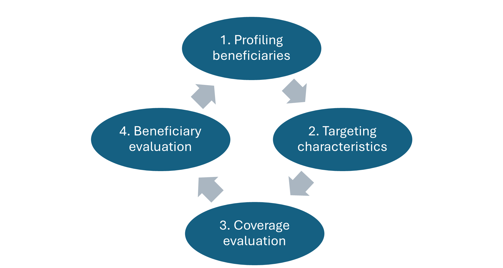

To maximize the practicality of the SPP-RAF, it has been built on four pillars:

-   **AI Use through Machine Learning Algorithms**: Machine learning algorithms are integrated into various stages of the process.

-   **Transparency**: The statistical techniques used to implement the SPP-RAF are:\

    a.  **Replicable**: Results are independent of the individual performing the calculations.\
    b.  **Scalable**: The same tools can be used even as programmes expand their beneficiary numbers or coverage.\
    c.  **Standardized**: The same analytical procedures can be applied across different programmes.\
    d.  **Adaptable**: The analytical tools reflect changes in programme priorities and inform policymakers accordingly.

-   **Quantitative Analysis of Administrative Records**: The process relies on administrative records that are periodically updated as part of programme operations.
    This makes the analysis cost-effective, as no additional data collection is required.
    Moreover, the process is designed to start with minimal data requirements and expand as the social protection system matures.
    The conclusions drawn from the analysis reflect the local context, as they are based on data gathered from the programme.

-   **Evidence-Based Decisions**: Conclusions from the process are supported by data, ensuring transparency and strengthening the accountability and legitimacy of the organization.
    For example, policies derived from these conclusions can help policymakers justify their decisions in public debates by referencing the supporting data.

-   **Potential for Integration into Programme Operations**: Once institutionalized, the SPP-RAF can be used as a regular tool to monitor and assess programme progress.
    It has the potential to identify:\

    a.  Beneficiaries who have improved sufficiently to graduate from the programme.\

    b.  Applicants facing institutional or educational barriers to accessing the programme.\

    c.  Programmes with selection criteria that are no longer relevant, such as due to the existence of parallel programmes or schemes.\

    d.  Programmes whose target populations have shifted, such as an increase in young women entering the labour market and a decreased need for social assistance support.

### **Context of the Programme to Analyze**

Social assistance programmes, which are primarily non-contributory forms of social protection, aim to alleviate poverty and vulnerability.
Social assistance is typically recognized through cash transfer programmes, either unconditional or conditional, that provide monetary transfers to target the most vulnerable households and/or individuals.
Identifying poverty and vulnerability, as evidenced by various measures of monetary and multidimensional poverty, is one of the key challenges these programmes face, as beneficiaries cannot self-select.

The programme under assessment for pedagogical purposes is a cash transfer programme implemented in 2023 in the country of **Nemey**.
The Ministry of Social Solidarity has provided administrative records for the first cohort of 2023, which includes data from 10,000 households (with 43 household-level variables) and 46,360 individuals (with 24 individual-level variables).
The collected data is essential for calculating the Proxy Means Test (PMT), which assigns a score to each household.
This score determines eligibility for the programme.

**Context of the Information**

The dataset was gathered from a social protection programme in the country of Nemey.
It includes information from 10,000 households, each with 43 variables, and data on 46,360 individuals, each with 24 variables.

**Key Variables in the Dataset:**

-   **Relationship to Head of Household**: Values range from 1-9, representing different relationships such as head of the family, wife/husband, daughter/son, mother/father, etc.

-   **Gender**: Indicates the individual's gender, either "Male" or "Female".

-   **Date of Birth**: States the individual's age in years.

-   **Marital Status**: Specifies whether the individual is single, married, divorced, or widowed.

-   **School Attendance**: Indicates whether the individual is currently enrolled in school, has dropped out, never enrolled, or graduated.

-   **Schooling Level**: Describes the highest education level achieved, ranging from illiterate to university level.

-   **Chronic Disease**: Indicates if the individual suffers from diseases like cardiovascular disease, cancer, or kidney failure (Yes/No).

-   **Nutrition Disease**: Specifies if the individual suffers from permanent malnutrition, stunting, or wasting (Yes/No).

-   **Common Disease**: Indicates if the individual suffers from other diseases (e.g., measles, diphtheria, or polio) (Yes/No).

-   **Disability**: Categorized by severity: total disability (unable to perform chores independently), partial disability (able to work), or other disabilities (Yes/No).

-   **Health Insurance**: Indicates whether the individual has access to health insurance (Yes/No).

-   **Employment Status**: Describes the individual's employment status: employed, unemployed, or inactive.

-   **Job Type**: Specifies the individual's job type (e.g., self-employed, paid in cash, paid in-kind, etc.).

-   **Contract Type**: Indicates the duration of the employment contract: permanent, temporary, seasonal, or not applicable.

-   **Employment Sector**: Specifies whether the individual works in the public or private sector (or does not apply if unemployed).

-   **Father Alive**: Indicates whether the individual's father is alive (Yes/No).

**Household Variables:**

-   **Household Members**: The total number of members in the household.

-   **House Type**: Describes the type of housing (e.g., villa, independent modern house, apartment, farmwork/wood/zinc, etc.).

-   **Contract Type**: The dwelling ownership type (owned, rented, endowed, or other).

-   **House Size**: The size of the house in square meters.

-   **Number of Rooms**: The total number of rooms available for household members to sleep in.

-   **Wall/Floor/Roof Material**: Describes the materials used for the walls, roof, and floor.

-   **Wall/Floor/Roof Quality**: Indicates the level of damage to these structures, categorized from 1 (highest damage) to 3 (least damage).

-   **Cooking Fuel**: The type of fuel used for cooking (gas, kerosene, firewood/animal waste, etc.).

-   **Toilet Type**: Specifies if the toilet is an Arab toilet or a syringe and whether it is shared or not.

-   **Water and Electricity**: Specifies the sources of drinking water, water, electricity, and sewage water.

-   **Duration to Nearest Market/School/Hospital**: The time (in minutes) it takes to reach the nearest market, school, and/or hospital.

-   **Household Properties**: Indicates ownership of various household items (e.g., kitchen, TV, mobile phone, car, fridge, etc.).

-   **Livestock**: Indicates whether the household owns livestock (Yes/No).

-   **Agricultural Land**: Specifies the area of agricultural land owned by the household.

-   **Real Estate**: Indicates whether the household owns real estate (Yes/No).

-   **Governorate**: Nemey is divided into eight governorates, represented by the letters A-H, along with districts, municipalities, and villages/cities.

-   **Location**: Specifies if the household is located in an urban, rural, or remote area.

The government calculates a score based on the variables above, and eligibility for the programme is determined by this score.

## **1.Preparing the datasets of Nemey**

The previous chapter delved into the details of connecting Excel and R to produce rapid reports.
This chapter implements these techniques extensively to begin the generation of the SPP-RAF report.
Keen readers may wonder why this chapter is not included in Part 2.
The reason is that Part 2 is reserved for statistical techniques, while this chapter serves as an introduction to that, i.e., producing relevant descriptive statistics.
Accordingly, this chapter, when placed in a report, can be referred to as Chapter 0 or an introductory chapter.
Here, the dataset is described through graphs and tables, setting the stage for the subsequent analysis.
For this chapter, as well as for the following chapters, the Excel files used are `DATA_BASES.xlsx` and `Beneficiaries.xlsx` (located in `Inputs/Data`) and `Dictionary.xlsx` (located in `Inputs/Dictionary`).

**Full code available at:**[ https://github.com/cafrancore/SPP_RAF_Public_Manual](https://github.com/cafrancore/SPP_RAF_Public_Manual)

Before starting any project, it is highly recommended to have an organized folder structure.
The suggested arrangement, as found in the teaching aid material, includes separate folders for input, code, and output.
Once everything is organized, you can create an R project and save it in the root folder (in the teaching aid, this project is named SPP RAF.

A project, for practical purposes, is like a folder where you can group multiple codes together.
These codes are aware that they interact with the same computer files.
While you can work with individual scripts, as we have done so far in the Master code *SPP_RAF_full_script.R*, splitting the code into manageable parts (e.g., chapters) is a good practice for larger projects.
This facilitates debugging and keeps the code clean.
In this context, the project serves as a powerful structure that integrates these separate files through a well-synchronized master file.
Unlike other sections, several functions here are covered superficially, as they do not significantly contribute to the reader’s general understanding, and their exact functionalities can be easily found online.

``` r
rm(list = ls())
graphics.off()
gc()

# Paste start time
startTime  = Sys.time()
```

The first four lines in the main script ensure that the software is clean, with no graphs or variables saved from previous exercises.
This helps speed up calculations and avoids errors caused by previously stored data.
The last line acts as a time controller, recording when the code begins to run.
Later, at the end of the master file, a complementary line records when the code stops running, allowing the user to determine the duration of the process.
This is particularly useful for estimating running times and planning work accordingly.
The code below, for example, defines a list of R packages (`myPackages`) commonly used for data manipulation, visualization, statistical modeling, spatial analysis, and reporting.
It checks which packages are not installed and installs them with dependencies.
Then, it loads each package one by one, displaying a message for each and handling any errors gracefully.
If the `extrafont` package is loaded and the system is Windows, it loads fonts for better plotting, particularly, as we are using Arabic as our second language.

``` r

# 1| Preparation --------------------------------------------------------
# 1.1| Libraries --------------------------------------------------------
# List of packages
myPackages <- c(
  'broom','caret','cluster','clValid','cobalt','colorspace','data.table','descr',
  'dplyr','extrafont','factoextra','FactoMineR','fastDummies','foreign','fpc','gbm',
  'geosphere','ggdendro','ggparty','ggplot2','ggpubr','ggspatial','ggmap','glmnet',
  'gridExtra','gtools','haven','here','Hmisc','igraph','Metrics','openxlsx','partykit',
  'PCAmixdata','ppcor','purrr','questionr','raster','RColorBrewer','readr','readxl',
  'reshape2','rpart','rpart.plot','scales','sf','shadowtext','spatstat','stars',
  'StatMatch','stringr','survey','tidyr','tidyverse','treemapify','writexl','eeptools',
  'lubridate','lattice','sfsmisc'
)

# Identify missing packages
notInstalled <- myPackages[!(myPackages %in% rownames(installed.packages()))]

# Install missing packages with dependencies
if (length(notInstalled)) {
  install.packages(notInstalled, dependencies = TRUE)
}

# Load packages one-by-one with feedback
for (pkg in myPackages) {
  message("Loading: ", pkg)
  tryCatch({
    library(pkg, character.only = TRUE, quietly = TRUE)
  }, error = function(e) {
    warning("Failed to load package: ", pkg, "\n", e$message)
  })
}

# Load fonts only if extrafont is available and on Windows
if ("extrafont" %in% loadedNamespaces() && .Platform$OS.type == "windows") {
  try(loadfonts(device = "win", quiet = TRUE), silent = TRUE)
}

# Disable scientific notation
options(scipen = 999)


# 1.2| Initial values locations and folders
# 1: English.
# 0: Arabic.
language = 0

# Specify location of file
userLocation   = enc2native(here()) # Replace by your own path.

## Create output folders if not available to save the output
if(!file.exists("Output")){
  dir.create("Output")  
}
if(!file.exists("Output/Clustering")){
  dir.create("Output/Clustering")  
}
if(!file.exists("Output/Targeting Assessment")){
  dir.create("Output/Targeting Assessment")  
}
if(!file.exists("Output/Coverage Evaluation")){
  dir.create("Output/Coverage Evaluation")  
}
# Location of Input and Code folders
scriptLocation = paste0(userLocation, '/Code/')
inputLocation  = paste0(userLocation, '/Input/')
```

#### **Updating main datasets: Individual and Household Data**

As previously noted, the programme selected for evaluation, for pedagogical purposes, is a Cash Transfer Programme implemented in the country of Nemey since 2023.
The datasets analyzed comprise information on 10,000 households (43 variables) and 46,360 individuals (24 variables).
All variables collected are essential for the Proxy Means Test (PMT), which, once estimated for each household, will generate a score of which will be discussed in the following sections.

``` r
##1.3 Uploading main datasets: Individual and Household Data  ---------------------------------------------------
IndividualData=read_excel(paste0(inputLocation, 'Bases/DATA_BASES.xlsx'), sheet = 'Individuals',na = "NULL")
HH_Data=read_excel(paste0(inputLocation, 'Bases/DATA_BASES.xlsx'), sheet = 'Households',na = "NULL")

IndividualData = IndividualData %>% 
  mutate(`Schooling level`=if_else(`Schooling level`%in%c("illiterat"), "illiterate",`Schooling level`))

IndividualData = IndividualData %>%
  mutate(Age = trunc((as.Date(`Date of birth`) %--% as.Date(Sys.Date()) / years(1) )))
```

#### Dictionary Uses and Calls in the Code

The Dictionary is a key feature that supports the cleaning and standardization of datasets, particularly when variable labels are not clear and/or require translation.
The dictionary provided for these exercises contains three sheets, which will be described in detail, along with an example code snippet demonstrating how to read and upload it in R.
The three sheets are:

1.  **Labels**: This sheet contains all the titles, subtitles, legends for X and Y axes for all the plots in English and Arabic.

``` r
# 1.4 Uploading dictionary - Labels  ---------------------------------------------------
dataPlots <- read_excel(paste0(inputLocation, 'Dictionary/Dictionary.xlsx'), 
                        sheet = 'Labels')
dataPlots[is.na(dataPlots)] <- '' # Replace NAs with characters
```

2.  **Category**: This sheet provides a correspondence table linking household and individual variables with their names in both English and Arabic. It also includes the levels of categorical variables, such as gender (Male or Female) and all variables with Yes/No categories.

``` r
# 1.5 Uploading Dictionary - Category ------------------------------------------------------
# Referring each graph to its specific labels in the dictionary
IndVarNames <- as.matrix(read_excel(paste0(inputLocation, 'Dictionary/Dictionary.xlsx'), sheet = 'Category', range = 'A8:D32')) 
HHVarNames <- as.matrix(read_excel(paste0(inputLocation, 'Dictionary/Dictionary.xlsx'), sheet = 'Category', range = 'F8:I51')) 

GenderLabels <- as.matrix(read_excel(paste0(inputLocation, 'Dictionary/Dictionary.xlsx'), sheet = 'Category', range = 'A1:D3')) 

YesNoLabels <- as.matrix(read_excel(paste0(inputLocation, 'Dictionary/Dictionary.xlsx'), sheet = 'Category', range = 'F1:I3')) 
```

3.  **Weights of the variable's categories**: According to the PMT (which will be explained later in Chapter 6), every variable of the social registry and their category has a weight according to the formula defined by the hypothetical case of the Nemey country. Many variables are based on observable characteristics of the housing. For example, if a house has cement walls without modest damage (weight is 20 in the Dictionary), the weight will be lower if the house has walls of wood with significant damages (weight is 90 in the Dictionary). Below is a chunk of code uploading the variables `Dwelling Type` and `Wall Type`. This format will definitely change according to the weights format, variables, iterations, among others, so this code is only indicative to follow the full example provided.

``` r
## 1.6 Uploading Dictionary - Weights
DwellingTypeWeights <- read_excel(paste0(inputLocation, 'Dictionary/Dictionary.xlsx'), sheet = 'Weights', range = 'A2:C46') %>%  #from to
  rename(`House type`=Dwelling_type, `Contract type`= Dwelling_ownership, var_Dwelling_type=weight)
WallTypeWeights <- read_excel(paste0(inputLocation, 'Dictionary/Dictionary.xlsx'), sheet = 'Weights', range = 'E2:G20')%>% #from to
  rename(`Wall material`=Wall_type, `Wall quality`= Damage_level, var_Wall_type=weight)
```

#### Updating names of columns and categories in the datasets

Once the dictionaries are loaded, the datasets must be transformed by replacing the names of variables that might not be clear with the full names provided in the dictionary.
Similarly, categorical data should be converted into factors for proper analysis.

``` r
# 1.7| Renaming variables in each dataset
------------------------------------------------------
colnames(IndividualData) = as.character(factor(colnames(IndividualData),
                                          levels = IndVarNames[,2],
                                          labels = IndVarNames[,4-1]))
colnames(HH_Data) = as.character(factor(colnames(HH_Data),
                                      levels = HHVarNames[,2],
                                      labels = HHVarNames[,4-1]))
HH_Data = HH_Data[,!is.na(colnames(HH_Data))]

# 1.10 Convert categorical variables of individuals dataset into factors. 1.10 section repeats the process for the househol ddataset 
------------------------------------------------------
# Also, in case another language wants to be used as a label for the data, this code will update to the language selected (in this case, language 1 is English, 0 is Arabic).

Individual_Data$`Gender` = as.character(factor(Individual_Data$`Gender`,
                                  levels = GenderLabels[,2],
                                  labels = GenderLabels[,4-language]))
Individual_Data$`School attendance` = as.character(factor(Individual_Data$`School attendance`,
                              levels = EducationAttainment[,2],
                              labels = EducationAttainment[,4-language]))
```

#### Vulnerability variables: Creation of new variables from Individual to Household datasets

Based on individual characteristics, household-level variables can be created to capture information such as the household illiteracy rate, the presence of NEET members (Not in Education, Employment, or Training), or whether there are children out of school.
These transformations involve multiple steps.
For pedagogical purposes, we will demonstrate the process for calculating the household illiteracy rate.
However, reviewing the complete code is essential for a full understanding in the section 1.8 and 1.9

``` r
# Example Creation of Relevant Variables from Individual to Household Datasets
------------------------------------------------------
Test_Iliteracy_rate = IndividualData %>% group_by(HHID) %>%
  mutate(illiterate = if_else(Age > 15 & `Schooling level` %in% c("illiterate"), 1, 0),
         members_15above = if_else(Age > 15, 1, 0)) %>%
  summarise(var_illiteracy_rate = 100 * sum(illiterate) / (sum(members_15above))) %>%
  mutate(var_illiteracy_rate = if_else(is.nan(var_illiteracy_rate), 100, var_illiteracy_rate))
```

## 2. PMT and Scoring Estimations

To address self-selection, many countries first select beneficiaries based on observable criteria such as age or disability, then conduct social surveys to comprehensively assess the socioeconomic status of household members.
This evaluation is converted into a set of observable variables that proxy the level of poverty or vulnerability of the households.
Based on statistical exercises, each variable has a certain "relevance" when explaining poverty or vulnerability.
For example, owning a house with a roof made of brick or asbestos is less important in explaining vulnerability compared to the employment status of the head of the household.
While both variables can explain vulnerability to some extent, the employment status is one of the most relevant factors.
The combination of variables and weights assigns a score to applicants or selected households, which ranks and determines their relative level of vulnerability.

### 2.1 Link the PMT weights with the Variables' categories

The weights of the variables were explained earlier in the chapter, particularly for non-binary variables such as wall type (iterated by damage) or dwelling property type (weights of the variable's categories).
For binary variables, such as car ownership (1 or 0), the weights are determined in the code: 10 for households without a bike and 0 for those with a car.

``` r
#Example, full code in section 1.8
------------------------------------------------------
Indicators_example = HH_Data %>%
  left_join(DwellingTypeWeights) %>% 
  left_join(WallTypeWeights) %>% 
  mutate(
    bike=if_else(`Bike`>0,0,10)
  )
```

Once all the variables are identified and linked to the household ID (`HHID`), the variables selected according to the PMT formula are chosen for the estimation of the PMT.
The scoring is estimated according to the formula below and represented in the following script

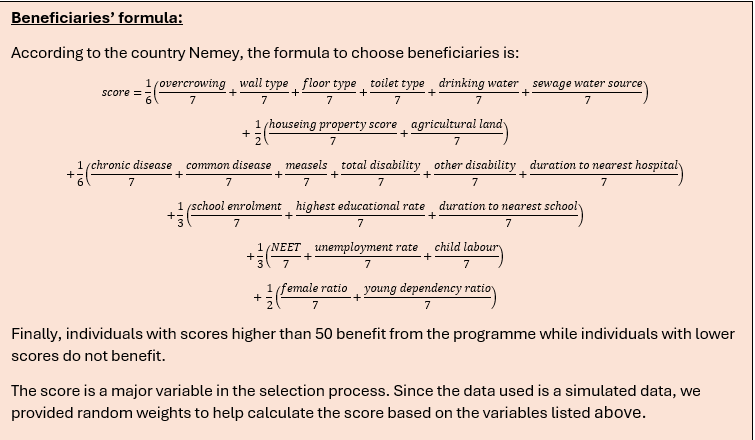

``` r
# 2| PMT estimation 
------------------------------------------------------
SCORING = PMTIndicators %>% 
  mutate(
    s_var_overcrowdingIssue = (1/6) * (1/7) * var_overcrowdingIssue, 
    s_var_Floor = (1/6) * (1/7) * var_Floor_type,
    s_var_Toilet = (1/6) * (1/7) * var_Toilet_Type,
    s_var_DrinkWater = (1/6) * (1/7) * var_Drinking_water,
    s_var_Sewage = (1/6) * (1/7) * var_sewage,
    
    s_var_Property = (1/2) * (1/7) * var_Property_score,
    s_var_agriLand = (1/2) * (1/7) * var_AgriLand,
    
    s_var_chronic = (1/6) * (1/7) * var_chronic,
    s_var_common = (1/6) * (1/7) * var_common,
    s_var_measels = (1/6) * (1/7) * var_measels,
    s_var_totdisab = (1/6) * (1/7) * var_tot_disab,
    s_var_otherdisab = (1/6) * (1/7) * var_other_disab,
    s_var_durationHospital = (1/6) * (1/7) * var_duration_hospital,
    
    s_var_enrolment = (1/3) * (1/7) * var_enrolment,
    s_var_higheducation = (1/3) * (1/7) * var_high_education_rate,
    s_var_durationSchool = (1/3) * (1/7) * var_duration_school,
    
    s_var_NEET = (1/3) * (1/7) * var_NEET,
    s_var_unemp = (1/3) * (1/7) * var_unemployment_rate,
    s_var_childLabour = (1/3) * (1/7) * var_child_labour,
    
    s_var_female = (1/2) * (1/7) * var_female_ratio,
    s_var_youngdependency = (1/2) * (1/7) * var_young_dependency_ratio,
    
    score = s_var_overcrowdingIssue + s_var_Wall + s_var_Floor + s_var_Toilet + s_var_DrinkWater + s_var_Sewage +
      s_var_Property + s_var_agriLand + s_var_chronic + s_var_common + s_var_measels + s_var_totdisab + s_var_otherdisab +
      s_var_durationHospital + s_var_enrolment + s_var_higheducation + s_var_durationSchool + s_var_NEET + s_var_unemp +
      s_var_childLabour + s_var_female + s_var_youngdependency
  ) %>%
  drop_na()
```

## **3. Clustering**

This section explains the conceptual elements of statistical clustering.
While it introduces the basic concepts, it primarily focuses on the clustering methods recommended for the SPP-RAF.
For those interested in a deeper exploration, Zelterman (2015) [^5] provides an excellent resource, particularly Chapters 11 and 10 (in that order).

[^5]: Zelterman, D.
    (2015).
    *Applied Multivariate Statisticas with R.* New Haven: Springer.

The problem of clustering is relatively easy to state: given a set of individuals with different traits, the goal is to group them into clusters where the characteristics within each group are similar, and the characteristics between groups are distinct.
However, this seemingly simple definition raises two key challenges:

1.  What criteria should be used to define similarity or dissimilarity between two individuals (Step 1)?
2.  How can we determine when two individuals are too different to belong to the same group (Step 2)?

Each of these questions presents multiple alternatives and methodological challenges.
As with previous topics, there is no single correct answer.
Indeed, the “Ugly Duckling” theorem[^6] demonstrates that clustering always involves a degree of subjectivity.
Consequently, analysts must rely on their domain knowledge to interpret data effectively within the given context.

[^6]: Watanabe, S.
    (1969).
    *Knowing and guessing; a quantitative study of inference and information.* New York: Wiley.

### Step 1: Distances

The first step in clustering is defining a measure of distance between individuals.
Several distance metrics can be used, each with different properties and implications.
Among the most common is the Euclidean metric, which measures the straight-line distance between two points $p$ and $q$, computed using the Pythagorean Theorem.

#### Example

Ahmed is 40 years old with 20 years of work experience, whereas Mohammed is 37.5 years old with 15 years of experience.
The Euclidean distance between them is: $$ \sqrt{(40 - 37.5)^2 + (20 - 15)^2} = 5.59 $$

Other distance metrics include: **Manhattan distance**, which is more robust to outliers because it does not square differences.
**Jaccard index**, which measures similarity between categorical data.
The Jaccard distance is derived by subtracting the index value from 1.

#### Scale Considerations

One crucial aspect when working with distances is the scale of the observations.
Consider the following individuals: - Ahmed: 40 years old, 20 years of work experience - Mona: 40 years old, 15 years of work experience - Maryam: 37.5 years old, 20 years of work experience - Mohammed: 37.5 years old, 15 years of work experience

Using the Euclidean metric, the distance between Maryam and Mona is also 5.59, the same as between Ahmed and Mohammed.
However, if we measure age in days instead of years, the distances become 16,303 for the men and 15,572 for the women.
This shift alters the ratio between the two distances (previously 1, now 1.05), affecting the clustering outcome.
Thus, proper standardization or transformation of variables is necessary to maintain consistency.

Another issue arises from the relationship between age and work experience.
As shown in Figure 3.1, these variables are highly correlated.
While geometrically the four individuals appear equidistant, conceptually they are not.
Ahmed and Mohammed follow a common pattern, whereas Maryam and Mona deviate from it.
Proper adjustments using covariance transformations can address this issue.

*Figure 3.1 Example of age vs working experience*

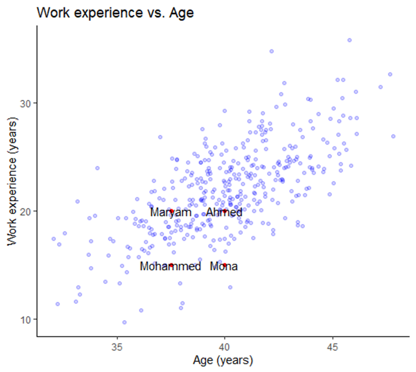

#### Mahalanobis Distance

A more sophisticated alternative to Euclidean distance is the **Mahalanobis distance**[^7], which accounts for correlations among variables.
This metric is invariant to scale and incorporates covariance structures, making it particularly useful for clustering multivariate data.
The later sections explain how to implement Mahalanobis distance in R.

[^7]: Mahalanobis, P. C.
    (1936).
    On the generalized distance in statistics.
    *Proceedings of the National Institute of Sciences of India*, 49-55.

Additionally, when assessing distances between multivariate datasets, it is useful to consider not just the direct distance between two points but also their distance relative to a distribution.
The Mahalanobis metric achieves this by incorporating the inverse covariance matrix, making it effective for imbalanced datasets and one-class classification.

### Step 2: Clustering

The clustering method proposed here is **hierarchical clustering**, using a bottom-up approach.
The code implements hierarchical clustering with **Ward linkage**, which minimizes variance within clusters, leading to balanced groupings.

Other linkage methods include **Single linkage (nearest neighbor linkage):** Useful for identifying irregularly shaped clusters, and **Complete linkage (farthest neighbor linkage):** Produces more compact clusters.

These methods are not implemented in the provided code but could be useful depending on the dataset.

There is no universal guideline for selecting a clustering method; it is recommended to test different linkages to determine which best reflects the data.
However, Ward linkage is often preferred when the goal is to obtain balanced clusters, as other methods may produce highly unbalanced structures.

Once a decision tree is generated, the next challenge at the policy level is determining the number of clusters required for profiling.
For instance, if policymakers aim to create three distinct targeting strategies, the corresponding dendrogram can help determine the appropriate cut-off.

### Step 3: Classification

While clustering helps group individuals, it does not explain why individuals are classified in a particular way.
To address this, two techniques are used: 1.
A descriptive approach (explained via examples).
2.
A technical approach using **classification and regression trees (CART)**[^8], a fundamental technique in machine learning.

[^8]: Breiman, L.
    (1984).
    Classification and regression trees.
    *The Wadsworth and Brooks-Cole statisticsprobability series.* Chapman & Hall.

#### Example

A target variable has four classes represented by different colors: Yellow (4 observations), Orange (5 observations), Green (8 observations), and Blue (10 observations).

The largest group is blue, so if no further information is available, the default classification is blue.
However, by incorporating additional variables—such as work experience, the algorithm refines the classification.
If an individual has over 25 years of experience, they are assigned to the orange category.
Further refinements occur with additional splits.

While it is possible to continue dividing the tree until each node contains only one class, this leads to **overfitting**, where the model captures noise rather than meaningful patterns.
Overfitting can result in misclassifications caused by minor data inconsistencies (e.g., typographical errors).
Therefore, the balance between accuracy and generalization must be considered.
For avid readers, the book of Gareth et al. (2017)[^9] provides an in-depth analysis of this issue.
However for the readers interested in the concept but not in the details, the following link provides practical explanations about the [decision tree depth](https://towardsdatascience.com/how-to-find-decision-tree-depth-via-cross-validation-2bf143f0f3d6.)

[^9]: Gareth, J., Witten, D., Hastie, T., & Tibshirani, R.
    (2017).
    *An Introduction to Statistical Learning: with Applications in R.* New York: Springer.

While the manual does not provide a line-by-line walkthrough of the code, the complete implementation is included.
The code is thoroughly commented to explain the logic and facilitate understanding, allowing readers to follow the methodology and adapt it as needed.

### Custom implementation for clustering (optional)

This section introduces the R code used for clustering (identified Manual Final/Code/Aux - Functions.R).
In previous methods, the number of clusters was determined automatically, often resulting in groups with minimal observations.
In contrast, the new approach specifies both the number of cuts and the final number of clusters to ensure meaningful segmentation.

The provided R code is a custom implementation for clustering and decision tree generation.
Unlike traditional packages, this approach: - Handles both numeric and categorical data.
- Includes a custom metric (`findingX`) to optimize cluster splits.
- Ensures a minimum cluster size (`basketLimit`).
- Uses squared Euclidean distance for robustness.
- Incorporates decision trees (`rpart`) for classification.

Three key functions are used: 1.
**`findingX`**: Identifies optimal cut points for clustering.
2.
**`treeGraph`**: Generates a network visualization of clusters.
3.
**`clusteringFunction`**: Executes clustering, refines clusters, and builds a decision tree.

This custom framework enables clustering across **46 variables for 150 observations**, specifically for Governorate A. The **distance matrix applies to PMT variables**, but clusters are profiled based on additional attributes (e.g., gender, region).

Despite its advantages, this method is computationally intensive.
Users seeking a simpler approach may consider standard algorithms such as `kmeans` or `hclust`.
However, this tailored approach ensures policy-relevant constraints and maintains cluster interpretability.

For the purpose of the code, we assume that the government of Nemey is interested in 5 groups or cluster, meaning that Nemey would like to categorize at least 5 types of beneficiaries.
At the beginning of the code there are some commands to prepare the datasets according to PMT and scoring estimated previously.

``` r
 basketLimit=max(15,ceiling(dim(BeneficiariesData)[1]*0.025)) 
 PolicyGroups=5 
 source() #Clustering Function'results are saved in  result List 
 resultList=clusteringFunction(BeneficiariesSelectionData, BeneficiariesDistanceData, basketLimit, PolicyGroups)
```

After the custom version of the clustering is executed, it is suggested to use decision trees which serve as both a refinement tool and an explanation mechanism for the clustering results.

In the code the first stage builds a constrained-depth decision tree (max depth = 4) to establish broad cluster definitions, while the second stage creates a more granular tree (minimum 2 observations per node) to capture finer patterns.
By using extremely small complexity parameters (cp ≈ 0), the algorithm prioritizes capturing the true cluster structure over preventing overfitting.
The final output includes both a visual decision tree (via `rpart.plot`) which explains cluster membership rules in terms of the original variables, and a frequency table summarizing the distribution of refined clusters.
This approach is particularly valuable for gaining a deeper understanding of beneficiary characteristics.

### Step 4. Descriptive statistics to assess the clusters

It is recommended to create a report, with visualizations and summary tables of results from the clustering analysis exercise.
The script, on the section 3.5 and owndars, contains a section that creats a workbook and then adds three main sections: (1) a dendrogram showing how data points are grouped into clusters (Figure 3.2), (2) a decision tree explaining the clustering rules , and (3) descriptive graphs comparing cluster characteristics/bar charts for categorical variables and average values for numerical variables.
Each section includes formatted plots (saved as PNGs) alongside supporting data tables, with text dynamically adjusted for either English or Arabic based on a language flag.

The code automates the entire reporting workflow—from generating plots with consistent styling (fonts, colors, labels) to organizing them in Excel with proper spacing.
It manages scaling, positioning, and language-specific formatting, then produces two final versions of the report: one in English (`CH 1 EN.xlsx`) and one in Arabic (`CH 1 AR.xlsx`).
The result is a polished, ready-to-share analysis that explains how clusters were formed and what differentiates them.
Below you can find a chunk creating the wb workbook and parameters for the Excel sheet that will save the dendogram in the Figure 3.2 (language AR).

``` r

# 3.5| Graphs
wb = openxlsx::createWorkbook(creator = 'ESCWA')

# 3.5.1| Dendrogram 
rowLine = 1
jumpOfRows = 18
colPlots = 1
colTables = 12

# Specify an indicatorCOde to be used as the name of the graph
indicatorCode <- '1_0'
part <- ''
labCodes <- dataPlots %>% subset(Code == paste0(indicatorCode, part))
newSheet <- addWorksheet(wb, sheetName = indicatorCode)


# To export:
base_exp = 1
heightExp = 1.5
widthExp = 1.2
scale_factor = base_exp/widthExp

# Cut same as number of maximum clusters
cutNumber=PolicyGroups
newPlot = fviz_dend(clust, k = cutNumber, color_labels_by_k = T, palette = as.character(labCodes[, 12]), show_labels = F,
                    rect = T, lower_rect = -0.02, rect_border = as.character(labCodes[, 12]), rect_fill = T) +
  labs(title = paste0(as.character(labCodes[, 5*(1-language)+2])),
       subtitle = as.character(labCodes[, 5*(1-language)+3]),
       caption = as.character(labCodes[, 5*(1-language)+6]),
       x = as.character(labCodes[, 5*(1-language)+4]),
       y = as.character(labCodes[, 5*(1-language)+5])) +
  scale_y_continuous(position = if (language == 0) {'right'} else {'left'}) + 
  theme_classic() +
  theme(legend.position = 'bottom',
        text = element_text(family = 'Georgia'),
        axis.line.x = element_blank(),
        axis.line.y = element_blank(),
        axis.text.x = element_blank(),
        axis.ticks.x = element_blank(),
        axis.text.y = element_text(size = scale_factor * 10, family = 'Georgia'),
        axis.title.x = element_text(hjust = 0.5, size = scale_factor * 10, family = 'Georgia'),
        axis.title.y = element_text(hjust = 0.5, size = scale_factor * 10, family = 'Georgia'),
        legend.text = element_text(size = scale_factor * 10, family = 'Georgia'),
        strip.text = element_text(size = scale_factor * 10, family = 'Georgia'),
        plot.title = element_text(face = 'bold', size = 10, family = 'Georgia', hjust = if (language == 0) {1} else {0}),
        plot.subtitle = element_text(size = 10, family = 'Georgia', hjust = if (language == 0) {1} else {0}),
        legend.key.size = unit(0.5 * scale_factor, 'cm'))

# Export graph and table to excel:
fileName = paste0(fileName = paste0(outputLocation, indicatorCode, part, 
                                    if(language == 1) {' (English)'} else {' (Arab)'}, '.png'))

ggsave(fileName, plot = newPlot, width = 6 * widthExp, height = 4 * heightExp * widthExp, scale = scale_factor)
insertImage(wb, file = fileName, sheet = indicatorCode, startRow = rowLine, startCol = colPlots, width = 6 * widthExp, height = 4 * heightExp * widthExp)

newData=as.data.frame(as.matrix(table(resultList$aggregatedCluster)))%>%
  mutate(Clusters=rownames(table(resultList$aggregatedCluster)))%>%
  rename(Observations=V1)%>%
  dplyr::select(Clusters,Observations)

writeDataTable(wb, sheet = indicatorCode, x = newData, startRow = rowLine, startCol = colTables)
rowLine = rowLine + jumpOfRows
```

*Figure 3.2 Report of dendogram (language Arabic)*

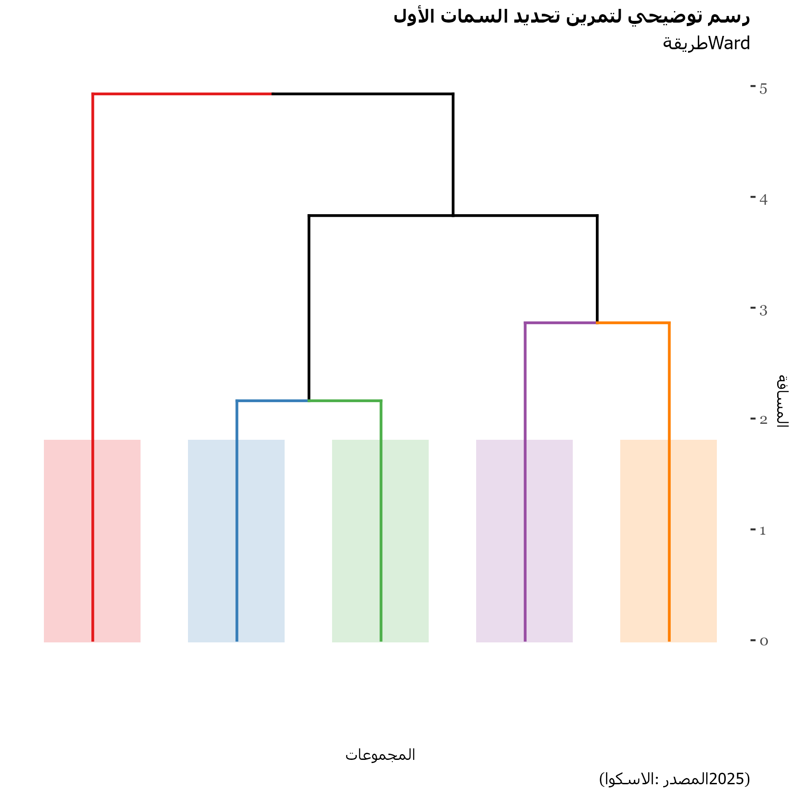**Descriptive statistics**

To get descriptive statistics is important to distinguish between qualitative and quantitative variables.
For qualitative variables ones a bar plot with the share by category and by cluster will be plotted while for qualitative variables the cluster will describe the mean by variable.
To understand the type of graphs and options refer to the Introduction R Manual.
The corresponding graphs can also be found in the Code Markdown.

``` r
# Distinguishing qualitative and quantitative vars for plotting and reporting

split <- splitmix(mainData) 
colnames(split$X.quali)=gsub("\\.", " ", colnames(split$X.quali))
colnames(split$X.quanti)=gsub("\\.", " ", colnames(split$X.quanti))

qualiMainData=mainData%>% dplyr::select(colnames(split$X.quali))%>%
  mutate(Clusters=factor(originalData$Clusters))

quantiMainData=mainData%>% dplyr::select(colnames(split$X.quanti))%>%
  mutate(Clusters=factor(originalData$Clusters))
```

*Figure 3.3 Example of descriptive statistics by cluster and schooling level (language English)*

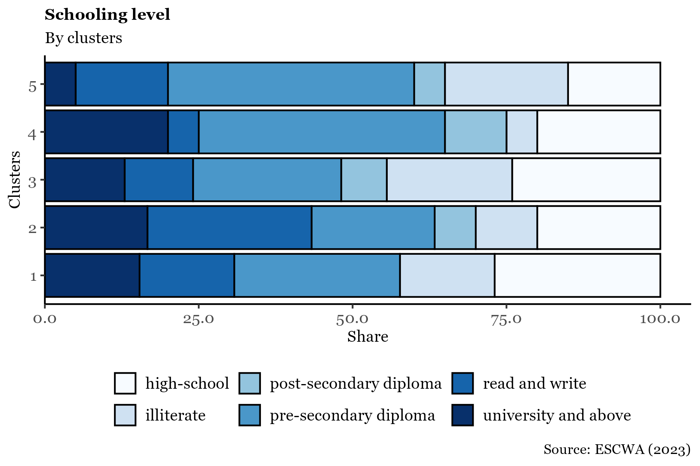

For a clear visual inspection of the outputs, a heatmap highlighting the maximum and minimum mean and proportions (for categorical variables) could be helpful to select the main characteristics considering the context and the purpose.
In the related code there is a section dedicated to the Cluster heatmap report.
It is important not to focus on the specific numerical values, but rather to use the table as a way to understand the general characteristics of the households within each cluster.
The clustering applied here is based on variables used in the PMT (Proxy Means Test) formula and those provided in the original datasets.
Although asset-related variables were indexed during clustering to reduce co-variability, they still play a significant role in the final results.
To gain deeper analytical insights into the differences between clusters, we recommend focusing on variables having as suffix “issue” or “rate”.
Definitions of these variables could be read in the script.

Guided by the color-coded heatmap and the selected variables shown in the screenshot below (which you can reproduce) you can begin your own analysis (Figure 3.4).
For instance, examining gender participation reveals that Cluster 5 is predominantly female, whereas Cluster 4 has lower female participation and limited representation.
Cluster 4 also exhibits higher levels of urban residency and is largely composed of single or divorced individuals, suggesting a profile of urban males who are typically unmarried.
This report will be processed automatically and saved in the folder *Output/Clustering.*

*Figure 3.4 Heatmap sheet to identify cluster's characteristics*

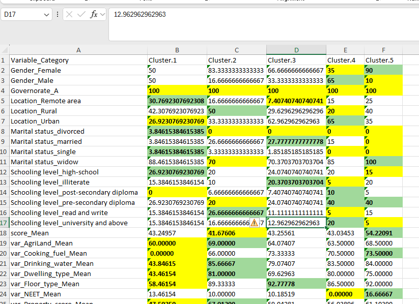

## 4. Targeting assessment

Social assistance programmes have limited resources and with very few exceptional cases, the number of resources is less than the population that needs the support.
For this reason, governments need to develop selection criteria to choose only those that will benefit the most from the programme.
However, one thing is the conceptual design of the strategy and another thing is its realization.
For example, consider a programme that requires people to have a mobile phone and in the region everyone has one.
Then, there isn’t really a prioritization going on.
Or on the other hand, consider a programme that gives equal weight to families with kids, and families with members that go to primary school.
As these variables are highly related, the common topic (kids in schools) might be weighted more than other variables that can also be relevant for choosing beneficiaries.
For this reason, this chapter develops two complementary techniques to understand how relevant the current decision criteria for the selection of beneficiaries are.

Once the profiling of beneficiaries is completed, the next step in the SPP-RAF framework is to evaluate the criteria used to determine programme participation.
This stage focuses on assessing the relevance of the selection variables in relation to the beneficiary profiles identified in the previous stage.
During this phase, the scores assigned to beneficiaries for each selection criterion are analyzed to understand their influence on the overall eligibility score and the resulting selection or exclusion of applicants.
In this stage, the data requirements include all variables used in the selection criteria for beneficiaries, and the weights applied to each variable in the scoring process.

**Outputs**:

-   A set of measurements ranking the selected variables based on their relevance to current beneficiaries and their impact on eligibility scores.

-   A comparative analysis between filter weights and variable scores to assess the alignment between intended and actual beneficiaries.

### Variance decomposition technique

While ideally, policymakers specify the weight of each variable in the decision criteria, in practice, once theory meets data, no strict ordering or weighting may be evident.
Consider a scenario where two variables, X and Y, are used to compute a score that determines whether an individual qualifies for a programme.
To simplify, the formula is:

$$
score= 1 * X + 1 * Y
$$

At first glance, this suggests that *X* and *Y* contribute equally.
However, consider their variances: suppose *Var(X) = 1* and *Var(Y) = 4*.
This implies that responses for X are relatively consistent across individuals, while Y varies significantly.
Assuming X and Y are independent, the variance of the score becomes:

$$ Var(Score) = Var(X) + Var(Y) = 1 + 4 = 5$$

Thus, *Y* accounts for 80% of the score’s variability, while *X* contributes only 20%.
If *X* is costly or difficult to collect, one must ask: *Is its 20% contribution worth the effort?*

**Semi-Partial Correlation Analysis**

To address such questions, this manual employs **semi-partial correlations** .
Suppose variable *Z* is explained by *X* and *Y*, but *X* shares some variance with *Y*.
To isolate *X*’s unique contribution to *Z*, we first remove the effect of *Y* from *X*, then assess how the residual variation in *X* relates to *Z*.

While sometimes referred to as a decomposition of *R²*, this is not strictly accurate, as the sum of semi-partial correlations may not equal *R²* due to the correlation structure among variables.
Nevertheless, *R²* serves as a useful benchmark (after squaring the semi-partial correlations), and values are typically interpreted in relation to it.
More information available [here.](https://www.statisticshowto.com/partial-correlation/)

In the script, the semi partial correlations using Pearson's method is estimated in order to compare the isolated contribution of the variable to the variance in the score against the R² value (coefficient of determination).
For analytical and visualization purposes, variables are normalized and ranked by their relative importance, then categorized into priority tiers (e.g., top 5%, next 5%, and so on).

``` r
# Semi-Partial Correlation (spcor)
sp = spcor(TestingData, method = c('pearson')) #semi-partial correlation


# Linear Regression (lm)
reg = lm(score ~ ., TestingData)
summary(reg)$r.squared
summary(reg)

# Variable Weights Calculation
weights = sp$estimate^2
weights = data.frame(Values = weights[dim(weights)[1], -dim(weights)[2]])
weights$names = TestingData %>% dplyr::select(-c('score')) %>% names() %>% .[1:nrow(weights)]
colnames(weights) = c('Values', 'Variable')

# Extracting Variable Names
result = NULL
tempRow = strsplit(as.character(weights$Variable), "_")
for(i in 1:dim(weights)[1]){
  result = c(result, tempRow[[i]][3])  
}
result = result[!result %in% c("Constant")]

# Weight Normalization and Ranking

weights1 = weights %>%
  mutate(
    Values = Values / R2,  # Normalize by R²
    Variable = result  
  ) %>%
  drop_na() %>%
  group_by(Variable) %>%
  summarise(Values = sum(Values)) %>%
  arrange(-Values) %>%
  mutate(
    Values = Values / sum(Values),  # Convert to proportions
    Variable = fct_reorder(Variable, Values),  # Reorder factor levels by importance
    AggregateSum = cumsum(Values) / sum(Values),  # Cumulative proportion
    ranking = case_when(
      AggregateSum > 0.95 & AggregateSum <= 1.01 ~ 4,
      AggregateSum > 0.90 & AggregateSum <= 0.95 ~ 3,
      AggregateSum > 0.80 & AggregateSum <= 0.90 ~ 2,
      AggregateSum > 0.00 & AggregateSum <= 0.80 ~ 1
    ),
    ranking = factor(ranking, levels = RankingPriorities[, 2], labels = RankingPriorities[, 4 - language])
  )
```

The code for the plot below is provided in the SPP_RAF_full_script.R.
It illustrates that variables such as unemployment rate and young dependency ratio are more influential in explaining the score, whereas others—such as floor type or toilet type have less impact.

*Figure 4.1 Variance influence*

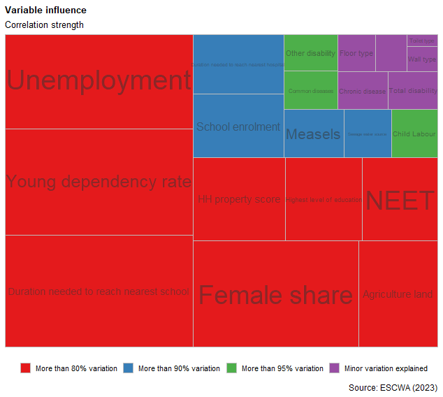

**Lasso Regression: Variable Selection and Shrinkage**

While the previous section focused on explanatory power, another approach examines the **magnitude of variable coefficients**.
Suppose the score is now defined as:

$$
Score = 0.1X + 10Y
$$

Although *X* has a much smaller coefficient, is it negligible?
To answer this, we use **Lasso regression**[^10], a technique that penalizes the inclusion of less important variables.

[^10]: Tibshirani, R.
    (1996).
    Regression Shrinkage and Selection via the lasso.
    Journal of the Royal Statistical Society.
    Series B (methodological), 267-288.

As mentioned earlier, Social Assistance programmes relied on the estimation of the Proxy Mean Test that  is defined though formulas like the following:

$$
PMT = Y = β₀ + β₁X₁ + β₂X₂ + ... + βₙXₙ
$$

In the formula, the *β* correspond to the weights and the *X* to the variables  identified ad conceptually relevant from the social registry  and/or surveys where applicants provide information about their socioeconomic variables.

 If the variables are transformed by a constant scalar:  $$
 z_i=β_i x_i
 $$  Then, the PMT becomes:  $$
 PMT=β_0+α_1 z_1+α_2 z_2+α_3 z_3+⋯+α_N z_N
 $$  Where $$α_1=α_2=⋯=α_N=1$$

So, in this second regression all the coefficients must be 1, and it will be used as a benchmark for the Lasso regression.
The linear regression exercise is to calculate the values of $$β_0,β_1, … β_N$$ that minimize the sum of squared errors: $$
min┬(β_0,β_1,… β_N )⁡〖(Y-β_0-β_1 X_1-〖...- β〗_N X_N )^2 〗
$$ Now, assume that having values of β different than 0 will cost.
So you also want to include that in the minimization exercise: $$
min┬(β_0,β_1,… β_N )⁡〖(Y-β_0-β_1 X_1-β_2 X_2-…-β_N X_N )^2+λ(|β_1 |+|β_2 |+⋯ +|β_N |)〗
$$

Hence, if *λ=0*, this will be a typical ordinary least square; in contrast, if *λ=∞*, all *β* will be 0 due to the high costs associated in having them.
Thus, by increasing *λ* slowly, the method begins to tell what the most important variables are, and there are even some technical criteria, to explain what is the best *λ* that explains Y by using the least number of variables.
Therefore, this exercise not only allows to remove those variables that are less meaningful, but also readjust the weights so that with fewer variables, the scores can still be properly forecasted.
In the script, Lasso regression is estimated by determining the optimal lambda through a cross-validation exercise, which is a standard approach in machine learning.
This is done using the `cv.glmnet` function, which performs cross-validation to select the lambda value that minimizes prediction error.
The overall process involves: Running Lasso regression across a range of lambda values, evaluating model performance (typically via cross-validation), Selecting the lambda with the lowest cross-validated error, analyzing the resulting coefficients to identify redundant variables.

``` r
# 4.5| Redundant Variable Analysis Using Lasso Regression 

# Create design matrix X for predictors (automatically handles factors/dummies)
X <- model.matrix(score ~ ., TestingData)

# Extract target variable
y <- TestingData$score 

# Set unconstrained bounds for LASSO coefficients
lb <- rep(-Inf, length(colnames(X)))
ub <- rep(Inf, length(colnames(X)))


# Estimate optimal lambda via cross-validated LASSO

cv_las1 = cv.glmnet(x = X, y = y, lower.limits = lb, upper.limits = ub)
lambda = cv_las1$lambda.min  # Best lambda minimizing CV error


# Fit LASSO model with optimal lambda
las1 = glmnet(x = X, y = y, lower.limits = lb, upper.limits = ub, lambda = lambda)

# Extract coefficients and zero out small ones (< 0.05)
c.fit1 = coef(las1) %>% as.matrix() %>% as.data.frame()
colnames(c.fit1) = c('Coefficient')
namesVar = rownames(c.fit1)
c.fit1$Coefficient[abs(c.fit1$Coefficient) < 0.05] = 0  # Threshold
```

Once the optimal lambda is identified, the model is estimated and the corresponding coefficients are examined.
In the Nemey dataset, there are no coefficients that are exactly zero for the optimized lambda, but some are small enough to be considered negligible.
These variables may not contribute significantly to the model and could be candidates for exclusion, "redundant variables".
To run the exercise testing different values of *λ* (lambda)—also known as the lambda tolerance or optimal lambda multiplier—the code iterates through the chunk below and saves the results for each lambda value.
Each lambda corresponds to a different model configuration:

-   Smaller *λ* → Low bias, high variance: The model fits the training data well but may overfit.

-   Larger λ → High bias, low variance: The model is simpler with fewer variables, but it may underfit.

By plotting the variables selected at each lambda level, we can observe which variables consistently drop out of the model as regularization increases.
These are likely to be the less informative or redundant variables.
More details and analytical graphs are available in the script.

*Figure 4.2 graph identifying potential variables to remove*

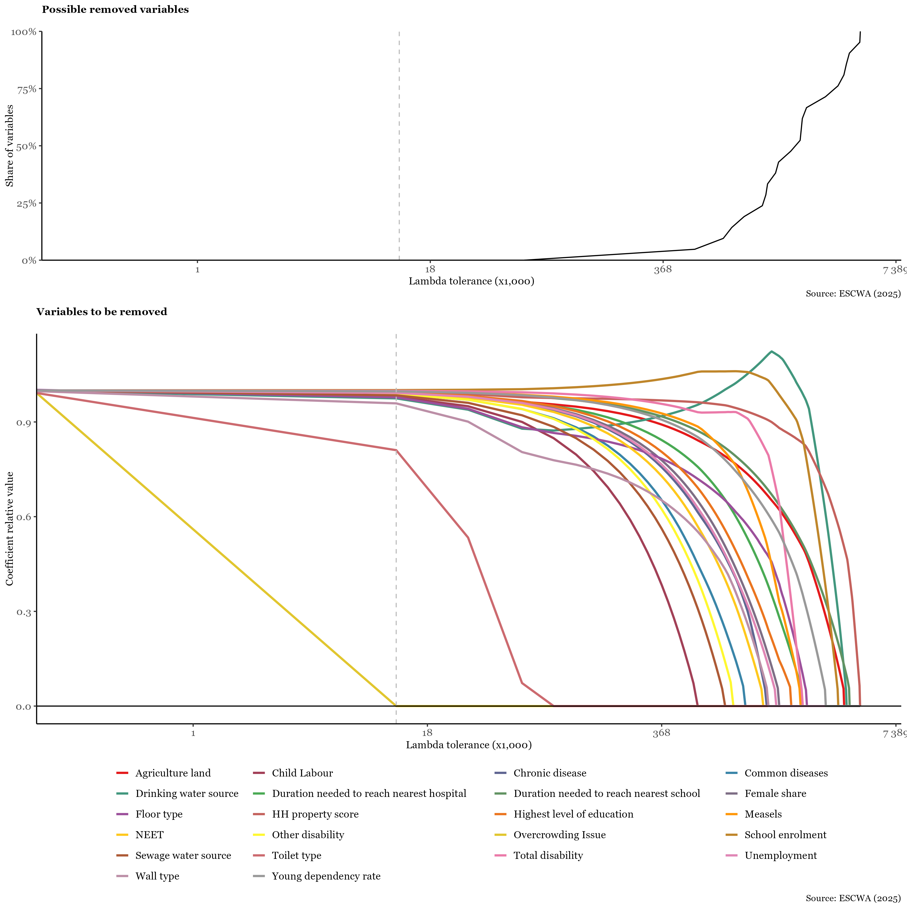

## 5. Coverage evaluation

The third stage of the framework focuses on identifying inclusion and exclusion errors.
On one hand, it analyzes the characteristics of current beneficiaries to flag individuals whose circumstances may have changed, suggesting they could be removed from the programme or transferred to a different one.
On the other hand, it identifies individuals who may meet the eligibility criteria (or are likely to meet them soon) but are not currently enrolled.
This dual approach enables policymakers to optimize resource allocation and assess whether outreach efforts should be intensified to improve enrollment effectiveness.

This stage produces three key outputs: Indicators that help identify potential beneficiaries, geographical areas where a higher concentration of households meet the eligibility criteria and Insights into targeting and eligibility processes, highlighting areas where inclusion of less vulnerable households may need to be addressed.

To conduct this analysis, it is essential to have data on the same variables for both beneficiaries and non-beneficiaries, including applicants who were not selected.
However, some programmes do not collect complete information from non-applicants.
In such cases, machine learning techniques can be employed to impute missing values.
Still, the success of the analysis heavily depends on the availability of a comprehensive dataset covering both groups.

To detect inclusion and exclusion errors the strategies are straight forward recalculating scores and compare theoretical beneficiaries with actual programme decisions whether the selection is via threshold - households below certain score- or quota selection - ranking households and selecting certain number of households as illustrated in Figure 5.1

*Figure 5.1 methods to select beneficiaries.*

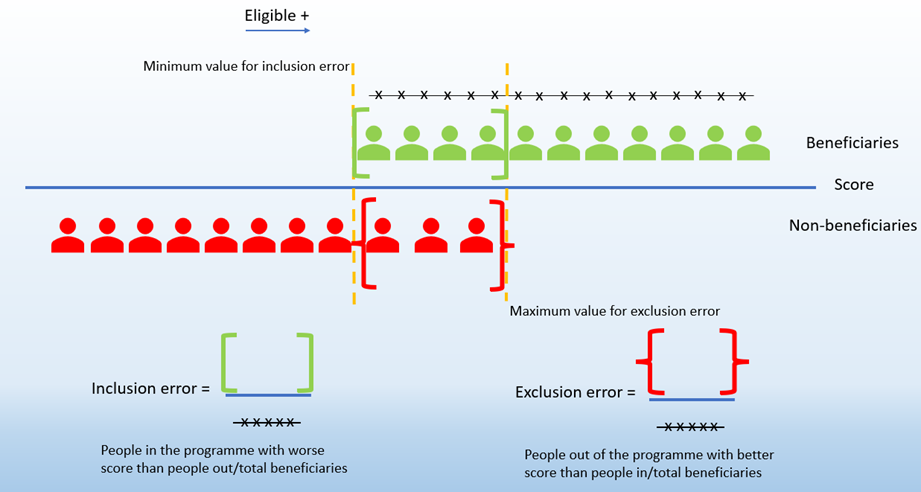

If desired, based on the inclusion and exclusion errors identified earlier in the chapter, a clustering exercise is recommended but not detailed in this manual.
For inclusion errors, clustering highlights the key variables that contributed to individuals receiving benefits despite not qualifying based on their score.
Although, this clustering approach differs from the explanation below as it includes all variables and could incorporate social workers’ assessments (in case the programme has information about it), the technical process is the same.

### **Threshold-based selection**

Let’s consider the threshold as a method for selecting beneficiaries.
The first step is to identify a new category of beneficiaries, referred to as *theoretical beneficiaries*.
Members are classified as theoretical beneficiaries if their score is greater than or equal to 40.
To identify inclusion and exclusion errors, we compare the beneficiary status provided earlier in the dataset with the newly defined theoretical beneficiaries.
The key section of the code is:

``` r

finalData= finalData %>% 
  mutate(
    theo_beneficiary = if_else(score>= 40, "Yes", "No")
  )
```

Based on this threshold analysis, we compare real beneficiaries with theoretical ones.
This comparison can be further analyzed by grouping data according to categorical variables, such as gender, as illustrated in the graph below.
For example, among all female real beneficiaries, only 75% were also theoretical beneficiaries.
Additionally, less than 8% of those who were not theoretical beneficiaries were still included as beneficiaries.
The code introduces inclusion and exclusion errors by relevant variables such as gender, and also generates a hypothetical map showing the distribution of theoretical beneficiaries.

*Figure 5.2 Example of inclusion/exclusion errors descriptive statistics by gender*

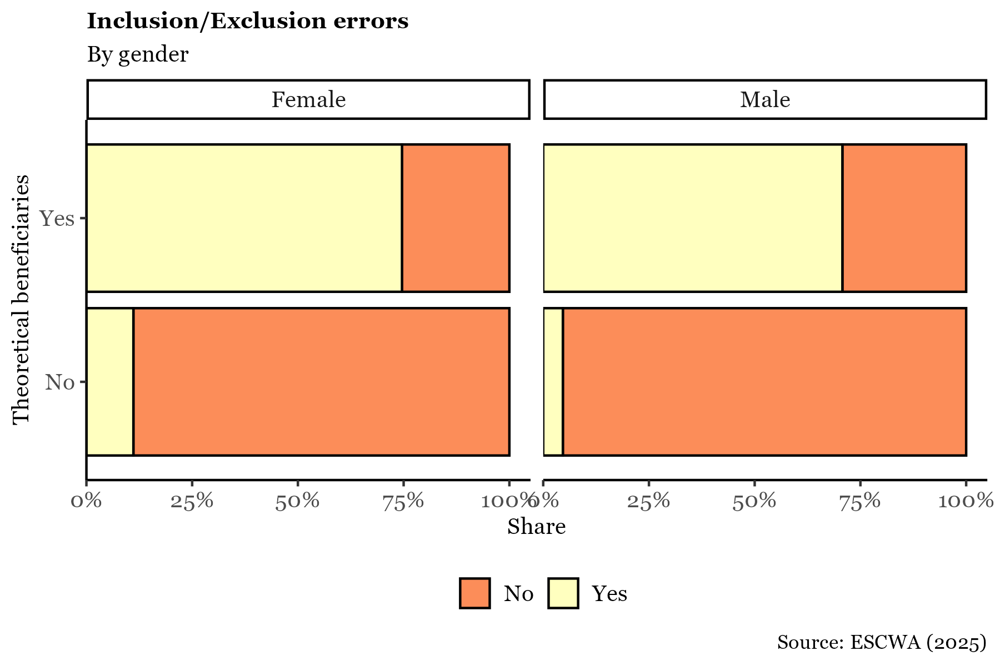

### **Ranking based selection: Fixed number of individuals/households selection**

When beneficiary selection is based on a **fixed number of individuals ranked by score**, the process differs from using a predetermined score threshold.
In this case, inclusion and exclusion errors cannot be defined by comparing scores against a fixed value.
Instead, the strategy must adapt to the ranking-based selection.

-   **Exclusion error** refers to individuals who were not selected as beneficiaries, yet have scores above the minimum score of those who were selected.
    This implies that some more vulnerable individuals were left out.

-   **Inclusion error** refers to individuals who were selected as beneficiaries, yet have scores below the maximum score found among the non-beneficiaries.
    This suggests that some less vulnerable individuals were included.

    One way to assess this visually is by comparing score distributions.
    Exclusion errors occur when individuals in the non-beneficiary group (left side of the distribution) have scores above the minimum score observed in the beneficiary group.
    In contrast, inclusion errors occur when beneficiaries have scores below the maximum score observed in the non-beneficiary group.

``` r
error_metrics <- finalData %>%
  drop_na(Beneficiaries, Governorate) %>%
  group_by(Governorate) %>%
  summarise(
    # Define thresholds
    min_inc = min(score[Beneficiaries == "Yes"], na.rm = TRUE),
    max_excl = max(score[Beneficiaries == "No"], na.rm = TRUE),
    
    # Inclusion error: beneficiaries with score below max score of non-beneficiaries
    incl_cases = sum(Beneficiaries == "Yes" & score < max_excl, na.rm = TRUE),
    benefiting = sum(Beneficiaries == "Yes", na.rm = TRUE),
    
    # Exclusion error: non-beneficiaries with score above min score of beneficiaries
    excl_cases = sum(Beneficiaries == "No" & score > min_inc, na.rm = TRUE),
    no_benefiting = sum(Beneficiaries == "No", na.rm = TRUE),
    
    .groups = "drop"
  ) %>%
  mutate(
    incl_error = incl_cases / benefiting,
    exc_error = excl_cases / no_benefiting
  ) %>%
  dplyr::select(Governorate, incl_error, exc_error)


# Split into separate datasets
temp_inc_final <- error_metrics %>% dplyr::select(Governorate, incl_error)
temp_exc_final <- error_metrics %>% dplyr::select(Governorate, exc_error)
```

Under this definition, inclusion error may appear disproportionately high.
This needs to be interpreted carefully, especially since the score is a relative measure of vulnerability, and many applicants, whether selected or not, may still be highly vulnerable.
For example, some individuals not selected due to other criteria (such as social worker evaluations) may still have high levels of vulnerability.

Therefore, using the maximum score of non-beneficiaries as a benchmark for inclusion error may not be ideal.
It is often recommended to assess inclusion errors against external vulnerability indicators, such as the poverty line, which are not relative to the sample.

Maps can also be produced using these definitions, as shown in the code.

*Figure 5.3 Inclusion Exclusion errors scores' density plot*

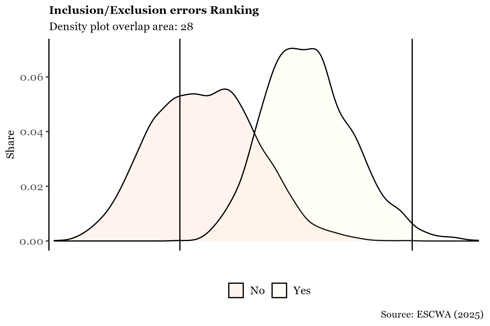

## **Annex: Missing values**

To address missing values and statistically compare the variables reported by applicants with those predicted based on other available information, a decision tree model can be employed.
This approach is particularly useful when the data is self-reported rather than observed directly, as applicants may tend to overstate their vulnerability to increase their chances of receiving benefits.
From an analytical perspective, it is also valuable to compare the actual vulnerability score with the score estimated statistically.
To do this, each variable is predicted individually using the remaining data, and a new "estimated" vulnerability score is calculated.
This score is then used to compute the Proxy Means Test (PMT), as illustrated below.

``` r

PMTIndicators1=PMTIndicators # to create
PMTIndicators2=PMTIndicators # to update

var_types <- list(
  discrete = c(
    "var_overcrowdingIssue", "var_Wall_type", "var_Floor_type", 
    "var_Toilet_Type", "var_Drinking_water", "var_sewage",
    "var_AgriLand", "var_chronic", "var_duration_hospital",
    "var_duration_school", "var_NEET"
  ),
  continuous = c(
    "var_Property_score", "var_common", "var_measels",
    "var_tot_disab", "var_other_disab", "var_enrolment",
    "var_high_education_rate", "var_unemployment_rate",
    "var_child_labour", "var_female_ratio", 
    "var_young_dependency_ratio"
  )
)

predict_variable <- function(var_name, data, new_data) {
  # Remove HHID and the target variable from predictors
  predictors <- data %>% dplyr::select(-HHID, -all_of(var_name))
  
  if (var_name %in% var_types$discrete) {
    # For discrete variables - classification tree
    formula <- as.formula(paste("factor(", var_name, ") ~ ."))
    tree <- rpart(formula, data = data %>% dplyr::select(-HHID), 
                  method = "class")
    pred <- as.numeric(as.character(predict(tree, new_data, type = "class")))
  } else {
    # For continuous variables - regression tree
    formula <- as.formula(paste(var_name, "~ ."))
    tree <- rpart(formula, data = data %>% dplyr::select(-HHID), 
                  method = "anova")
    pred <- predict(tree, new_data)
  }
  
  return(pred)
}


for (var in c(var_types$discrete, var_types$continuous)) {
  PMTIndicators2[[var]] <- predict_variable(var, PMTIndicators1, PMTIndicators1)
}

SCORING2 = PMTIndicators2 %>% 
  mutate(
    s_var_overcrowdingIssue=(1/6)*(1/7)*var_overcrowdingIssue, # the value next to each variable is its weight. in this case we specified the weight but in other cases we have to stick to the weight given
    s_var_Wall=(1/6)*(1/7)*var_Wall_type,
    s_var_Floor=(1/6)*(1/7)*var_Floor_type,
    s_var_Toilet=(1/6)*(1/7)*var_Toilet_Type,
    s_var_DrinkWater=(1/6)*(1/7)*var_Drinking_water,
    s_var_Sewage=(1/6)*(1/7)*var_sewage,
    
    s_var_Property=(1/2)*(1/7)*var_Property_score,
    s_var_agriLand=(1/2)*(1/7)*var_AgriLand,
    
    s_var_chronic=(1/6)*(1/7)*var_chronic,
    s_var_common=(1/6)*(1/7)*var_common,
    s_var_measels=(1/6)*(1/7)*var_measels,
    s_var_totdisab=(1/6)*(1/7)*var_tot_disab,
    s_var_otherdisab=(1/6)*(1/7)*var_other_disab,
    s_var_durationHospital=(1/6)*(1/7)*var_duration_hospital,
    
    s_var_enrolment=(1/3)*(1/7)*var_enrolment,
    s_var_higheducation=(1/3)*(1/7)*var_high_education_rate,
    s_var_durationSchool=(1/3)*(1/7)*var_duration_school,
    
    s_var_NEET=(1/3)*(1/7)*var_NEET,
    s_var_unemp=(1/3)*(1/7)*var_unemployment_rate,
    s_var_childLabour=(1/3)*(1/7)*var_child_labour,
    
    s_var_female=(1/2)*(1/7)*var_female_ratio,
    s_var_youngdependency=(1/2)*(1/7)*var_young_dependency_ratio,
    
    score2 = s_var_overcrowdingIssue  + s_var_Wall + s_var_Floor +  s_var_Toilet + s_var_DrinkWater + s_var_Sewage + s_var_Property + s_var_agriLand + s_var_chronic + s_var_common + s_var_measels + s_var_totdisab + s_var_otherdisab +
      s_var_durationHospital + s_var_enrolment+ s_var_higheducation + s_var_durationSchool + s_var_NEET +  s_var_unemp + s_var_childLabour +s_var_female +  s_var_youngdependency )%>%
  drop_na()
```
